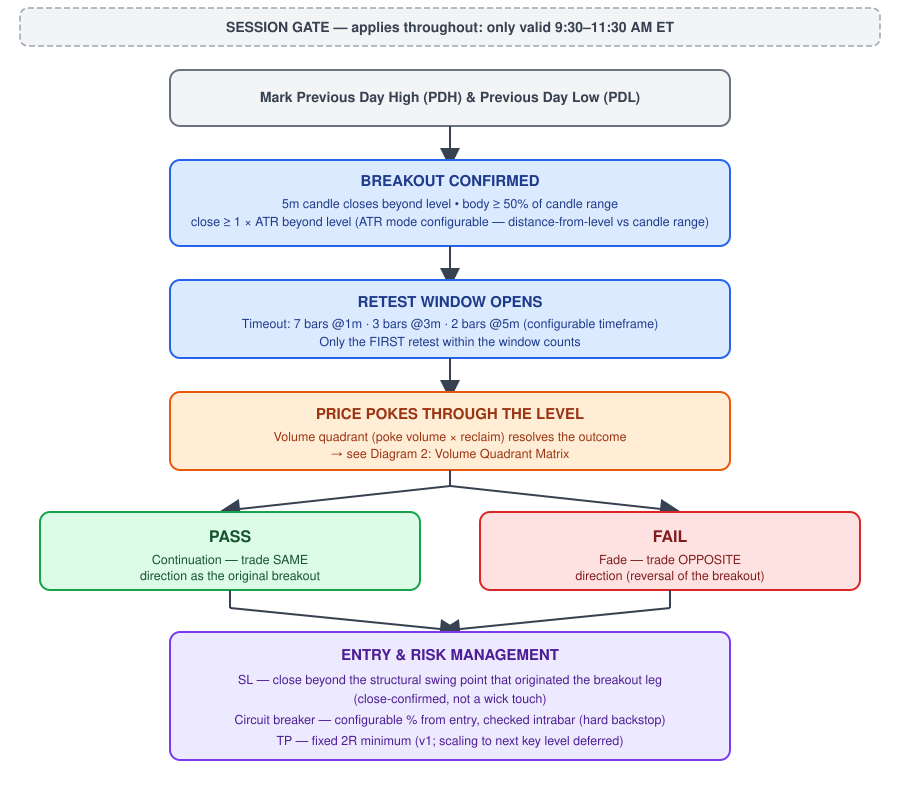
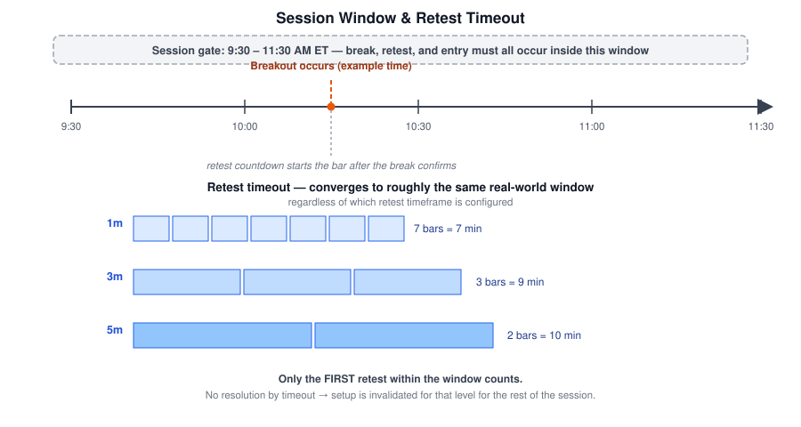
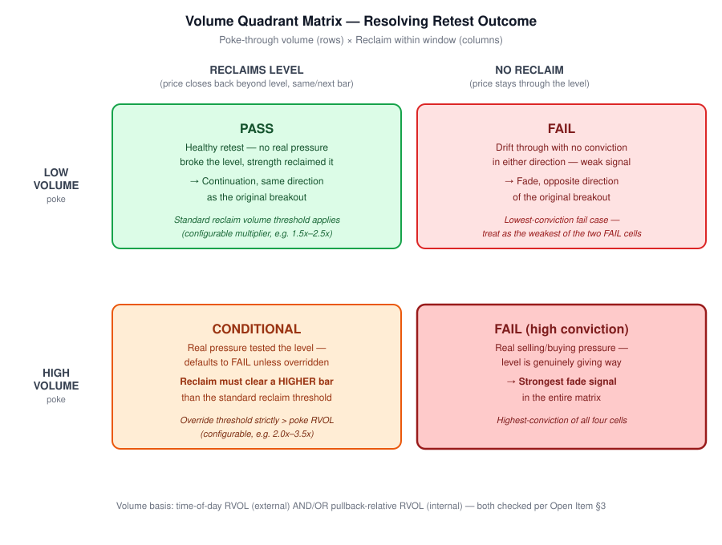
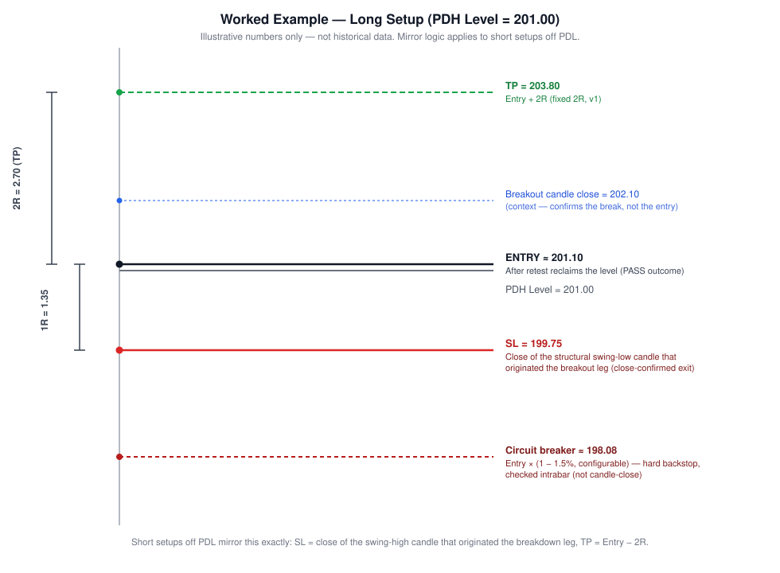

# Break and Bounce — Strategy Specification

**Status:** Draft v0.1 — core architecture locked, volume thresholds pending backtest calibration
**Last updated:** June 19, 2026
**Target instruments:** Futures (MNQ/MES-style), adaptable to any PDH/PDL-driven product
**Build workflow:** Claude (architecture) → Cursor (Pine Script v6 implementation) → Claude Code (git/terminal)

---

## 1. Concept Summary

Break and Bounce trades the **first retest** of a broken Previous Day High (PDH) or Previous Day Low (PDL). A 5-minute candle breaks the level with real displacement behind it; price then comes back to test the level on a faster timeframe. How that retest behaves — confirmed by volume, not just price — decides the trade:

- If the level **holds** (low-conviction poke, high-conviction reclaim) → trade the **continuation**, same direction as the original break.
- If the level **fails** (price can't reclaim it, or real pressure broke it outright) → trade the **fade**, opposite direction — this is effectively trading the failed breakout / liquidity-grab case.

The setup is intentionally symmetric: every break produces a tradeable outcome in *one* direction or the other, never a "no signal."



---

## 2. Key Levels

| Level | Definition |
|---|---|
| **PDH** | Previous Day High — the high of the prior full trading session |
| **PDL** | Previous Day Low — the low of the prior full trading session |

These are the only levels this strategy trades against in v1. (Tier-2 enhancement: cross-reference with the existing Volume Profile indicator's POC/VAH/VAL — see §13.)

---

## 3. Breakout Definition — LOCKED

A breakout is confirmed on the **5-minute chart** when ALL of the following are true on a single candle:

1. **Close beyond the level** — candle closes above PDH (long case) or below PDL (short case).
2. **Body ≥ 50% of candle range** — `|close − open| / (high − low) ≥ 0.5`. Filters out indecision/doji candles masquerading as breaks.
3. **Displacement ≥ 1× ATR** — the breakout must show real force behind it. Two interpretations are both implemented as a config toggle, to be A/B tested in backtest:
   - **Mode A — distance from level:** `|close − level| ≥ 1 × ATR(14, 5m)`
   - **Mode B — candle's own range:** `(high − low) ≥ 1 × ATR(14, 5m)`, regardless of how far past the level it closes

   > ⚠️ Mode A is a strict filter — on most futures instruments a single 5m candle rarely travels a full ATR *beyond* a level while also closing with ≥50% body. Expect Mode A to produce noticeably fewer signals than Mode B. Run both through backtest before picking a default.

**Formula reference:**
```
body_pct      = abs(close - open) / (high - low)
break_long    = close > PDH and body_pct >= 0.50 and displacement_ok
break_short   = close < PDL and body_pct >= 0.50 and displacement_ok

// displacement_ok, Mode A:
displacement_ok = abs(close - level) >= 1.0 * atr14_5m

// displacement_ok, Mode B:
displacement_ok = (high - low) >= 1.0 * atr14_5m
```

---

## 4. Retest Definition — Structure LOCKED, Volume Mechanics see §5

Once a breakout is confirmed, the strategy switches to a configurable **retest timeframe** (1m / 3m / 5m) and watches for the level to be retested.

### 4.1 Retest Timeout

| Retest Timeframe | Timeout | Real-Time Equivalent |
|---|---|---|
| 1m | 7 bars | ≈ 7 minutes |
| 3m | 3 bars | ≈ 9 minutes |
| 5m | 2 bars | ≈ 10 minutes |

All three converge to roughly the same real-world decision window regardless of which timeframe is configured — this is intentional, so changing the retest timeframe doesn't change how long the setup stays "live."

### 4.2 First Retest Rule

**Only the first retest within the timeout window is tradeable.** If price chops near the level multiple times, the first candle that resolves (reclaims or fails to reclaim, per §5) is the one that's traded. If no retest occurs before timeout, the setup is invalidated for that level for the remainder of the session.

### 4.3 Session Filter

The entire sequence — break, retest, and entry — must occur between **9:30 AM and 11:30 AM ET**. A break confirmed outside this window, or a retest that resolves after 11:30 AM ET, does not generate a trade.



---

## 5. Volume Confirmation Logic — Logic LOCKED, Thresholds OPEN (pending backtest)

This is the piece that decides trade direction. The retest resolves into one of four outcomes depending on (a) how much volume showed up on the poke through the level, and (b) whether price reclaimed the level afterward.

### 5.1 The Four Outcomes



| Poke Volume | Reclaims Level? | Outcome | Trade Direction |
|---|---|---|---|
| Low | Yes | **PASS** | Continuation — same direction as breakout |
| Low | No | **FAIL** | Fade — opposite direction (low conviction) |
| High | Yes | **CONDITIONAL** — defaults to FAIL unless reclaim volume clears a strictly higher override threshold | Fade unless overridden, then Continuation |
| High | No | **FAIL (high conviction)** | Fade — opposite direction (strongest signal in the matrix) |

**Rationale for the asymmetry:** a low-volume poke means nothing tested the level with real conviction, so a strong-volume reclaim is sufficient proof of strength. A high-volume poke means real pressure already tested the level — reclaiming it requires *more* volume than that poke showed, not just the standard threshold, or the reclaim itself is suspect.

### 5.2 Two Complementary Volume Measures

Volume should never be compared raw across different bar sizes — a 1m bar inherently carries a fraction of a 5m bar's volume. Each timeframe is measured against its own native baseline.

**A) External / Absolute — Relative Volume (RVOL), time-of-day-matched:**
```
RVOL(bar) = volume(bar) / avg_volume_at_this_time_of_day(lookback_days)
```
Matched to the same minute-of-day across the trailing N days (not a flat trailing average — a naive 20-period VMA is distorted right after the open, which matters a lot for a 9:30–11:30 session).

**B) Internal / Relational — sequence-based, self-contained within the setup:**
```
pullback_avg_volume = average(volume of poke-through bar(s))
reclaim_ok           = reclaim_bar_volume >= pullback_avg_volume * reclaim_multiplier
pullback_healthy     = pullback_avg_volume <= breakout_candle_volume * pullback_fraction
```
This doesn't depend on a clean historical baseline — it just asks "did volume shrink on the way down and expand on the way back," which is the textbook "price goes down, volume dries up" pullback pattern.

Both checks run as a confluence gate (breakout passes the absolute RVOL check **and** the pullback/reclaim shape passes the relational check). Which one ends up doing most of the work is itself a backtest question.

### 5.3 Parameters Pending Calibration

| Parameter | Starting Sweep Range | Basis |
|---|---|---|
| Breakout candle RVOL (time-of-day) | 1.3x – 3.0x | External |
| Poke-through RVOL ("low") | 0.5x – 0.9x | External |
| Reclaim RVOL — standard case | 1.2x – 2.0x | External |
| Reclaim RVOL — override case (must exceed poke RVOL) | 2.0x – 3.5x | External |
| Pullback fraction of breakout volume | 0.6x – 0.8x | Internal |
| Reclaim multiplier vs. pullback average | 1.5x – 2.5x | Internal |
| Time-of-day baseline lookback | 10 – 30 trading days | External |

> 🔶 **Not finalized.** These ranges are starting points for a parameter sweep, not committed defaults. Treat §5 as architecturally complete but numerically open until backtested on the actual instrument/timeframe.

---

## 6. Trade Direction Resolution

| Retest Outcome | Direction |
|---|---|
| PASS | Same direction as the original 5m breakout (continuation) |
| FAIL (any variant) | Opposite direction of the original breakout (fade / reversal) |

---

## 7. Stop Loss — LOCKED

The stop is anchored to **market structure**, not an arbitrary candle count back.

**Definition:** SL = the close of the **structural swing point** that originated the breakout leg — i.e., the most recent swing low (long case) or swing high (short case) the price moved away from to create the breakout. This reuses the same swing/pivot detection logic already used for BOS/CHoCH identification, rather than introducing a new "scan back N candles for an opposite color" rule, which has no natural bound and can land on an arbitrary candle if several same-direction candles precede the breakout.

**Trigger condition:** the stop fires only on a **confirmed candle close** beyond the SL price — not an intrabar wick touch. This avoids being stopped out by noise, consistent with the close-based stop logic already used elsewhere in your systems.

**Trade-off:** because the primary stop waits for a close, actual risk can exceed the nominal SL distance if price spikes hard before a candle closes. See §8.

---

## 8. Circuit Breaker — LOCKED mechanism, % OPEN

A secondary, independent hard stop that exists purely to cap tail risk while the close-confirmed structural stop is waiting for a candle to close.

- **Trigger:** price moves a configurable **% from entry**, checked **intrabar** (tick-by-tick), not on candle close.
- **Relationship to structural SL:** the circuit breaker sits *beyond* the structural SL distance — it's a backstop for a runaway move, not a tighter primary stop.
- **Parameter:** `circuit_breaker_pct` — configurable, to be set empirically (illustrative example below uses 1.5%).

---

## 9. Take Profit — LOCKED for v1

- **v1:** fixed minimum of **2R** (R = entry-to-SL distance).
- **Deferred to a later version:** scaling exits (e.g., your existing 70/20/10 partial structure) and/or extending the target to the next key level (5MH/5ML, opposite PDH/PDL) when it sits beyond 2R.

---

## 10. Worked Example

**Setup:** Long break of PDH = 201.00.



| Step | Value | Note |
|---|---|---|
| PDH Level | 201.00 | Key level |
| Breakout candle close | 202.10 | Confirms the break — not the entry price |
| Entry | ≈ 201.10 | After retest reclaims the level (PASS outcome) |
| Structural swing-low candle | low = 199.75 | The swing the breakout leg originated from |
| **SL** | **199.75** | Close beyond this price exits the trade |
| 1R | 1.35 | Entry − SL |
| **TP (2R)** | **203.80** | Entry + 2R |
| Circuit breaker (1.5% example) | ≈ 198.08 | Intrabar backstop, beyond the structural SL |

Short setups off PDL mirror this exactly: SL = close of the swing-high candle that originated the breakdown leg, TP = Entry − 2R.

---

## 11. Configurable Parameters — Master Table

| Parameter | Type | Status |
|---|---|---|
| ATR displacement mode (distance-from-level vs. candle range) | Toggle | Open — sweep both |
| Body % minimum | Numeric | Locked at 50% |
| ATR multiplier for breakout displacement | Numeric | Locked at 1.0x |
| Retest timeframe | 1m / 3m / 5m | Configurable by design |
| Retest timeout (bars) | 7 / 3 / 2 | Locked per timeframe |
| Session window | Time range | Locked (9:30–11:30 ET) |
| Breakout RVOL threshold | Numeric | Open — see §5.3 |
| Poke-through RVOL threshold | Numeric | Open — see §5.3 |
| Reclaim RVOL threshold (standard / override) | Numeric | Open — see §5.3 |
| Pullback / reclaim relational multipliers | Numeric | Open — see §5.3 |
| Time-of-day baseline lookback (days) | Numeric | Open — see §5.3 |
| Circuit breaker % | Numeric | Open — empirical |
| TP (R-multiple) | Numeric | Locked at 2R for v1 |

---

## 12. Explicitly Out of Scope for v1

These were raised during design and deliberately deferred — not forgotten:

1. **Context filters** (ADX trend-strength gate, HTF/QQQ-SPY bias agreement) — not part of v1 trade logic.
2. **TP scaling** — fixed 2R only for now; partial-exit scaling is a later iteration.
3. **Volume Profile confluence** — checking whether the retested level also sits near a POC/VAH/VAL node from the existing key-levels + Volume Profile indicator. Natural tier-2 filter given that infrastructure already exists, but not required for the base logic to function.

---

## 13. Glossary

| Term | Definition |
|---|---|
| **PDH / PDL** | Previous Day High / Previous Day Low |
| **ATR** | Average True Range — volatility measure, 14-period unless noted |
| **RVOL** | Relative Volume — current bar's volume divided by a historical baseline for the same context |
| **R-multiple** | Risk unit; 1R = the entry-to-stop distance. TP at "2R" = twice that distance, in the trade's favor |
| **Structural swing point** | The most recent local low (for longs) or local high (for shorts) that price moved away from to create the breakout leg — the same concept used in BOS/CHoCH swing detection |
| **Body %** | `|close − open| / (high − low)` — how much of a candle's range is "real" directional movement vs. wick |
| **Circuit breaker** | A hard, intrabar, %-based stop that exists independently of the structural stop, purely to cap tail risk |
| **Poke-through** | Price crossing the level during the retest, whether or not it closes back beyond it |
| **Reclaim** | Price closing back beyond the level after a poke-through |

---

## 14. Decision Log

| Decision | Rationale |
|---|---|
| ATR displacement made configurable (two modes) rather than picking one | Mode A (distance-from-level) risked starving signal count, same failure mode as ATHENA's overly strict backtest filters — resolve empirically instead of guessing |
| SL changed from "last opposite-colored candle" to "structural swing point" | Unbounded lookback on candle color alone could land on an arbitrary candle; swing-point logic is already built (BOS/CHoCH) and gives a structurally meaningful anchor |
| Circuit breaker added as a separate mechanism from the structural SL | Close-confirmed stops avoid wick noise but leave risk uncapped during a fast runaway move before a candle closes |
| Volume quadrant's 4th case (high-volume poke + reclaim) resolved as conditional, not a flat pass | A high-volume poke means real pressure already tested the level — reclaiming it should require *more* proof than a low-volume poke would, not the same threshold |
| Volume measured two ways (external RVOL + internal relational) rather than one | External handles "is this significant for the day," internal handles "does this specific setup's shape look healthy" — independently testable, not redundant |
| TP fixed at 2R for v1, scaling deferred | Get the directional logic validated first before adding exit complexity |

---

*Next step: numeric calibration of §5 volume thresholds via backtest sweep, then handoff to Cursor for Pine Script v6 implementation.*
